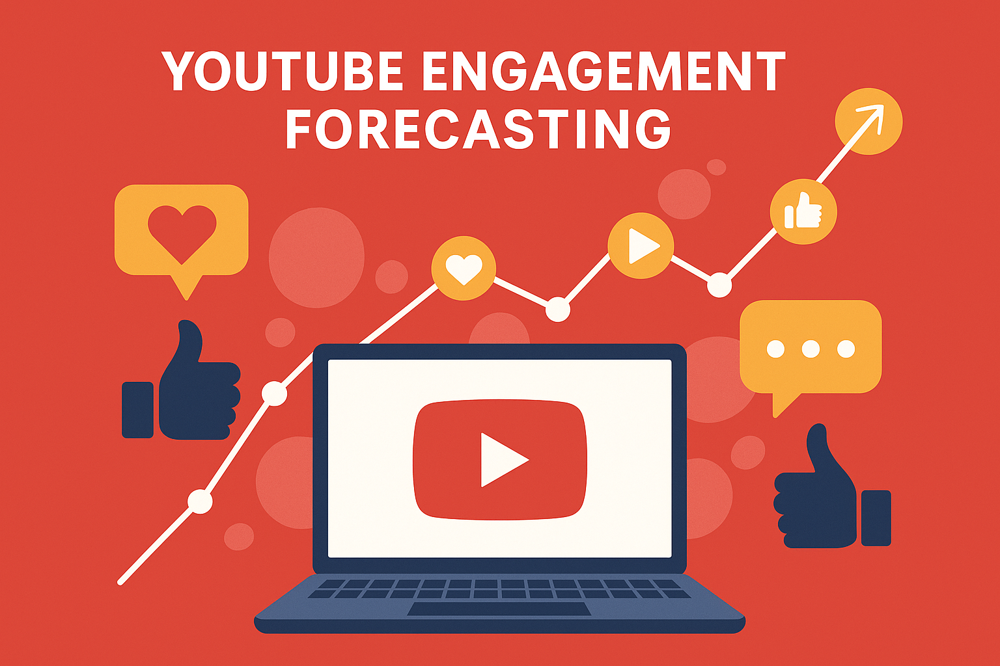

# 📊 YouTube Engagement Forecasting with Time Series Models

This project explores and compares several time series forecasting models to predict YouTube video **engagement metrics** — namely **Likes**, **Comments**, and **Views** — and determine trends in audience interaction over time. The ultimate goal is to provide actionable insights for creators, marketers, or data analysts to optimize content strategies.

---

## 🧠 Project Aim & Objectives

### 🎯 **Aim**
To forecast YouTube engagement metrics using traditional and deep learning time series models and compare their effectiveness in capturing viewer interaction dynamics.

### ✅ **Objectives**
- Preprocess and aggregate raw YouTube engagement data into daily time series.
- Apply forecasting models: **SARIMA**, **Prophet**, **LSTM**, and **GRU**.
- Fine-tune deep learning models using **Keras Tuner** for optimal architecture.
- Evaluate all models using **MAE** and **RMSE** on the last 30-day actuals.
- Select the best model (GRU) and forecast the next **30 days** of engagement.
- Visualize and interpret the forecast for strategic content planning.

---

## 🛠️ Tools & Libraries Used

- **Python 3.9**
- `TensorFlow`, `Keras`, `Keras Tuner`
- `statsmodels`, `fbprophet`
- `matplotlib`, `seaborn`, `pandas`, `numpy`
- `scikit-learn` for scaling and evaluation metrics

---

## 🔍 Model Comparison

| Model   | Likes RMSE | Comments RMSE | Views RMSE | Observations |
|---------|------------|----------------|------------|--------------|
| SARIMA  | ❌ High     | ❌ High         | ❌ High     | Weak trend detection |
| Prophet | ⚠️ Medium  | ⚠️ Medium       | ⚠️ Medium  | Captures seasonality |
| LSTM    | ✅ Good     | ✅ Good         | ✅ Good     | Needs tuning |
| **GRU** | 🏆 Best     | 🏆 Best         | 🏆 Best     | Best overall accuracy |

---

## 📈 Forecast (Next 30 Days)

Based on the best-performing **GRU model**, the next 30-day forecast reveals:

- 📉 **Comments** expected to decline steadily, potentially indicating reduced discussions or shares.
- 📉 **Likes** will also decrease, suggesting waning user enthusiasm without new high-performing content.
- 📈 **Views** will **gradually rise**, showing consistent reach—potentially from long-tail or evergreen content.

These insights can inform **release timing**, **community engagement**, and **content format** decisions.

---

## 💡 Strategic Recommendations

- 🎥 **Introduce engaging content** in the coming weeks to counteract projected drops in likes/comments.
- 📊 **Monitor video categories** gaining the most views and double down on those formats.
- 💬 **Boost community interaction** (e.g., polls, Q&A, comments prompts) to lift comment engagement.
- 📅 **Schedule promotional pushes** or collaborations aligned with peak view periods.

---

## ✅ Project Closure

This project successfully demonstrates how time series forecasting — especially with deep learning models like GRUs — can **predict and analyze YouTube engagement trends**. These insights support **data-driven content planning**, helping creators and analysts stay ahead of viewer behavior.

---

## 📁 Files

- `models/`: Saved GRU models
- `predictions/`: `.npy` files for model predictions
- `plots/`: Forecast and comparison visualizations
- `notebooks/`: Full experimentation and modeling notebooks

---

## 👨‍💻 Author

**Abdullah Shahzad**  
📧 Email: [abdullahshahzadhunjra@gmail.com](mailto:abdullahshahzadhunjra@gmail.com)  
🔗 GitHub: [github.com/abdullahhunjra](https://github.com/abdullahhunjra)  
🔗 LinkedIn: [linkedin.com/in/abdullahhunjra](https://linkedin.com/in/abdullahhunjra)

---

## 📃 License

MIT License. Free to use, modify, and distribute.